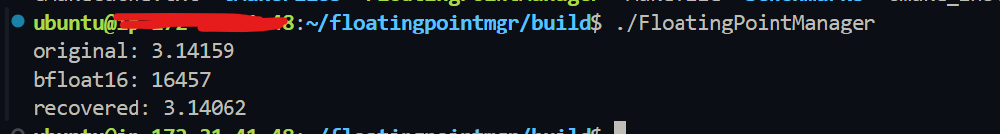

# Floating Point Manager

# Floating Point Manager

FloatingPointMgr is a C++ project for experimenting with floating-point behavior, precision handling, and performance characteristics. It serves as a small, modular sandbox for testing and benchmarking floating-point operations.

## Structure
    ├── include/        # Public headers
    ├── src/            # Implementation
    ├── tests/          # Unit tests
    ├── benchmarks/     # Performance benchmarks
    ├── CMakeLists.txt
    └── main.cpp

## Features

- C++17
- CMake build system
- Modular floating-point utilities
- Unit tests and benchmarks
- Example executable

## Build

```bash
git clone https://github.com/abeldiress/floatingpointmgr.git
cd floatingpointmgr
mkdir build && cd build
cmake ..
make
```

## Example Output



## Usage

APIs are defined in `include/`. `main.cpp` provides a simple example entry point.

